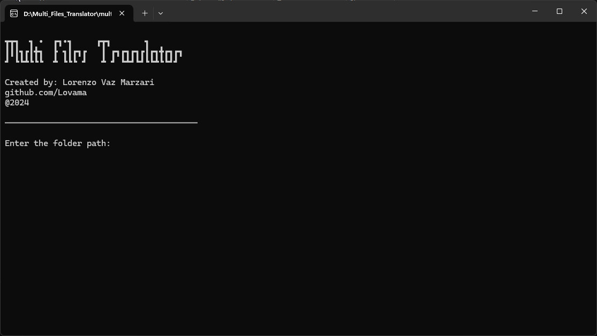
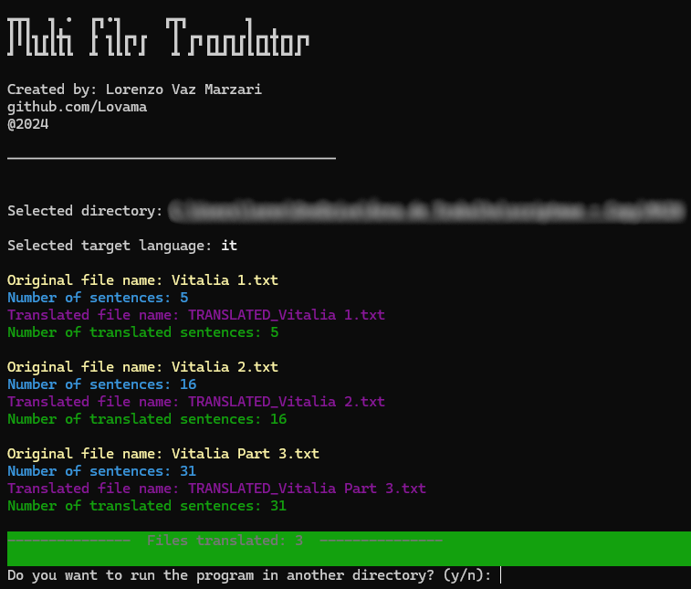

# Multi-File-Translator

A Python script to translate text files in bulk using Google Translate.



## Features

- Translates multiple text files concurrently.
- Supports translation into various languages.
- Easy-to-use command-line interface.
- Progress bar for tracking translation progress.

## Installation

1. Clone the repository:

    ```bash
    git clone https://github.com/Lovama/Multi-File-Translator.git
    ```

2. Navigate to the project directory:

    ```bash
    cd Multi-File-Translator
    ```

3. Install the required dependencies:

    ```bash
    pip install -r requirements.txt
    ```

## Usage

1. Run the script:

    ```bash
    python translator.py
    ```

2. Enter the folder path containing the text files you want to translate.

3. Enter the target language code (e.g., 'en' for English, 'fr' for French).

4. Sit back and relax while the script translates your files!

## Example



## Contributing

Contributions are welcome! Please feel free to submit issues or pull requests.

## Credits

- Developed by [Lorenzo Vaz Marzari](https://github.com/Lovama)
- Powered by [Google Translator](https://pypi.org/project/deep-translator/)
- Built with [NLTK](https://www.nltk.org/) and [termcolor](https://pypi.org/project/termcolor/)
- Progress bar by [tqdm](https://pypi.org/project/tqdm/)

## License

This project is licensed under the MIT License - see the [LICENSE](LICENSE) file for details.

